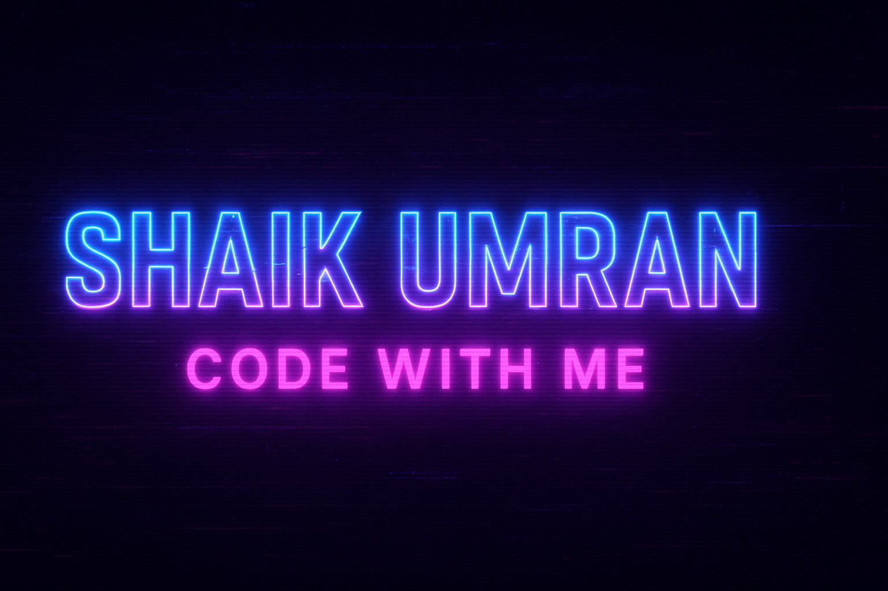

  

  

---

#  Hey there, I'm Umran!

I am an **AI and Software Engineer** passionate about building robust systems, conversational AI architectures, and intelligent workflows. I love turning complex logic into structured, readable code and leveraging machine learning to solve real-world problems.

###  Current Focus & Explorations
-  Working on **Multi-LLM consensus architectures** and reliable generation pipelines.
-  Building and optimizing **Retrieval-Augmented Generation (RAG)** systems with long-term memory.
-  Experimenting with machine learning models and data preprocessing pipelines.
-  Fun fact: I turn ☕ into code and chaos into creativity.

---

### 🌐 Connect with Me

  
  
  
  

---

### 🛠️ Languages, Frameworks & Tooling

  <!-- Languages -->
  
  
  
  
  
   
  <!-- AI / ML -->
  
  
  
  
   
  <!-- Tools -->
  
  
  

---

###  Highlighted Projects

| Project | Stack | Description |
| :--- | :--- | :--- |
|  **[Artemis-Consensus](https://github.com/umran666/Artemis-Consensus)** | `Python` | A Multi-LLM Ensemble System designed for reliable answer generation and logical verification using consensus voting. |
|  **[ChatBot_With_Memory](https://github.com/umran666/ChatBot_With_Memory)** | `Python` `LangChain` | An intelligent AI chatbot that retains conversation history and queries PDF documents via Retrieval-Augmented Generation. |
|  **[AI-Career-Guidance](https://github.com/umran666/AI-Career-Guidance)** | `TypeScript` `React` | An intelligent career guidance system built using AI to help users explore, plan, and navigate careers in AI/ML fields. |
|  **[AD-Blocker](https://github.com/umran666/AD-Blocker)** | `JavaScript` | A lightweight browser extension that removes intrusive ads, popups, and tracking scripts from web pages. |

---

###  GitHub Stats & Dynamic Telemetry

  
  
  

---

  ⭐️ <i>From <a href="https://github.com/umran666">Shaik Umran</a></i>

