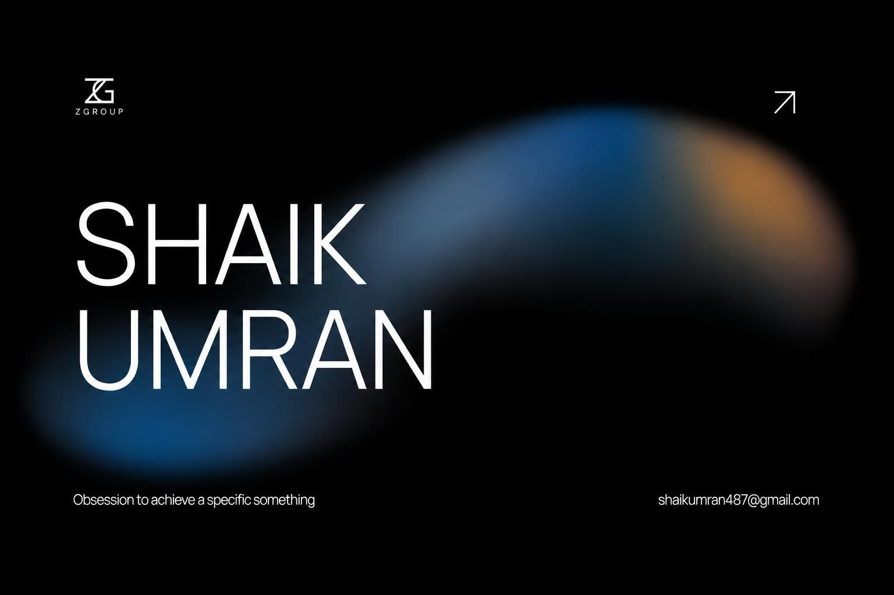

<!-- BANNER -->
<p align="center">
  
</p>

<p align="center">
  <a href="https://git.io/typing-svg"></a>
</p>

<p align="center">
  <a href="https://github.com/umran666"></a>
  
  <a href="https://github.com/umran666?tab=repositories"></a>
</p>

<p align="center">
  <a href="https://linkedin.com/in/shaik-umran-2729bb359"></a>
  <a href="https://youtube.com/@shaikumran3581"></a>
  <a href="https://bento.me/umran7"></a>
  <a href="mailto:shaikumran487@gmail.com"></a>
</p>

<br/>

<!-- ═══════════════════════ ABOUT ═══════════════════════ -->

<h2 align="center">About Me</h2>

<p align="center"><i>Turning high-dimensional vectors into deterministic software, and coffee into resilient code.</i></p>

<table align="center">
  <tr>
    <td width="50%" valign="top">

```yaml
Role: AI & Software Engineer

Current Focus:
  - Multi-LLM Consensus Architectures
  - RAG Pipelines with Persistent Memory
  - High-Throughput Inference Workflows
  - Zero-Downtime Autonomous AI Systems

Approach:
  - Build Reliable, Not Flashy
  - Ship Clean, Ship Fast
```

  </td>
    <td width="50%" valign="top">

```yaml
Experience With:
  - Conversational AI & Memory Systems
  - Vector Search & Document Retrieval
  - Ensemble Model Orchestration
  - Browser Extension Engineering

Philosophy:
  - Simple Beats Complex
  - Working Beats Perfect
```

  </td>
  </tr>
</table>

<br/>

<!-- ═══════════════════════ TECH STACK ═══════════════════════ -->

<h2 align="center">Tech Stack</h2>

<p align="center">
  
</p>

<p align="center">
  
  
  
  
  
  
</p>

<br/>

<!-- ═══════════════════════ PROJECTS ═══════════════════════ -->

<h2 align="center">Featured Projects</h2>

<table align="center">
  <tr>
    <td width="50%" valign="top">
      <h3 align="center"><a href="https://github.com/umran666/Artemis-Consensus">Artemis-Consensus</a></h3>
      <p align="center">
        
        
        
      </p>
      <p align="center"><i>Multi-LLM ensemble that aggregates model responses through consensus voting and logical verification. Built for hallucination resistance.</i></p>
    </td>
    <td width="50%" valign="top">
      <h3 align="center"><a href="https://github.com/umran666/ChatBot_With_Memory">ChatBot With Memory</a></h3>
      <p align="center">
        
        
        
      </p>
      <p align="center"><i>PDF-aware conversational AI with vector search and persistent conversation memory that compounds context over time.</i></p>
    </td>
  </tr>
  <tr>
    <td width="50%" valign="top">
      <h3 align="center"><a href="https://github.com/umran666/AI-Career-Guidance">AI Career Guidance</a></h3>
      <p align="center">
        
        
        
      </p>
      <p align="center"><i>Interactive career navigation with dynamic skill assessment and personalized AI/ML learning tracks.</i></p>
      <p align="center"><a href="https://ai-career-guidance-five.vercel.app"><b>Live Demo</b></a></p>
    </td>
    <td width="50%" valign="top">
      <h3 align="center"><a href="https://github.com/umran666/AD-Blocker">AD Blocker</a></h3>
      <p align="center">
        
        
      </p>
      <p align="center"><i>Lightweight browser extension that strips ads, popups, and tracking scripts for a pristine, faster web.</i></p>
    </td>
  </tr>
</table>

<br/>

<!-- ═══════════════════════ STATS ═══════════════════════ -->

<h2 align="center">GitHub Stats</h2>

<p align="center">
  
</p>

<p align="center">
  
  &nbsp;&nbsp;
  
</p>

<p align="center">
  
</p>

<br/>

<!-- ═══════════════════════ FOOTER ═══════════════════════ -->


<p align="center">
  <sub>Built with focus by <a href="https://github.com/umran666"><b>Shaik Umran</b></a></sub>
</p>
